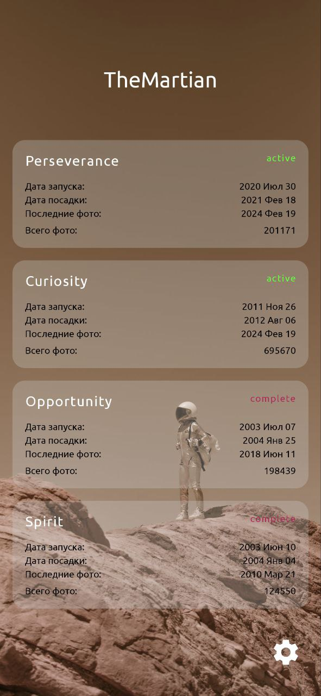

# TheMartian
В приложение TheMartian собраны фотографии с четырех марсианских роверов, два из которых на данный момент еще действующие, поэтому новые фотографии приходят практически ежедневно.

Список роверов: Perseverance (действующий), Curiosity (действующий), Opportunity (миссия завершена), Spirit (миссия завершена)

Понравившиеся фотографии можно сохранить в избранное внутри приложения или скачать на свое устройство. С помощью фильтра можно выбрать дату фотографий, а также камеру, на которую было сделано фото. Приложение кэширует данные для более быстрой загрузки фотографий. Настроить или отключить кэш можно в настройках.

Окунитесь в неповторимую атмосферу красной планеты. Приятного полета!

