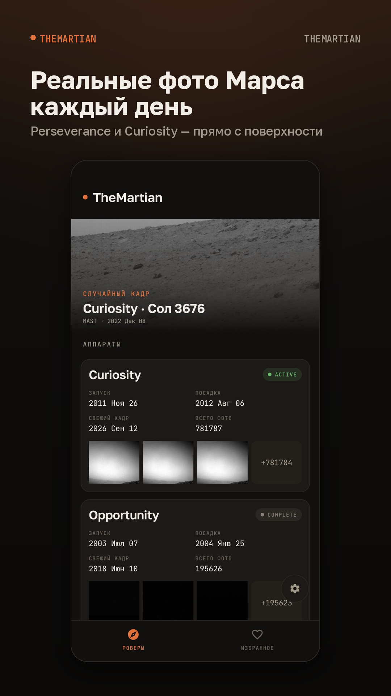
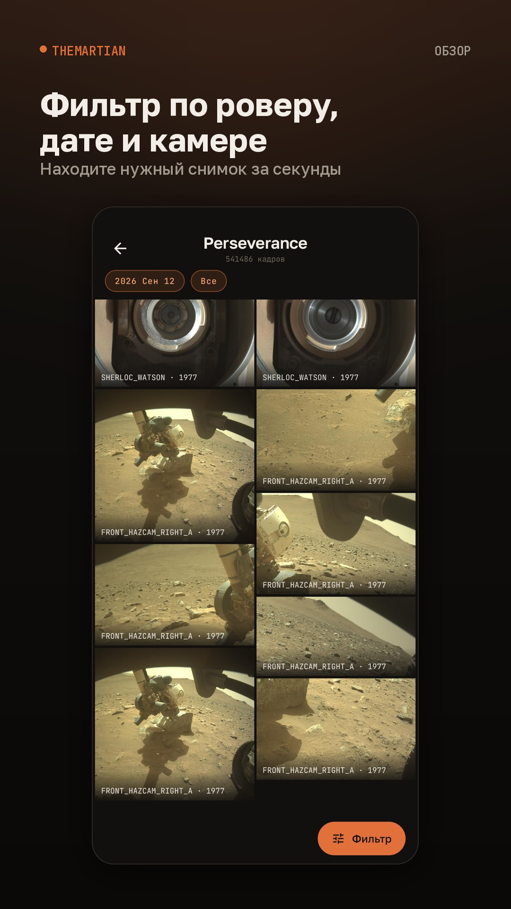
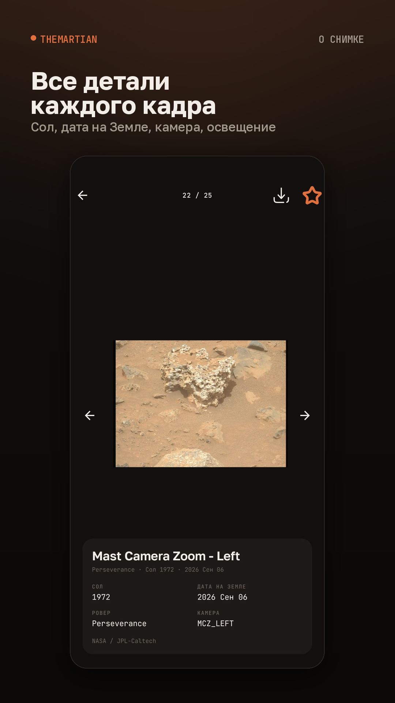
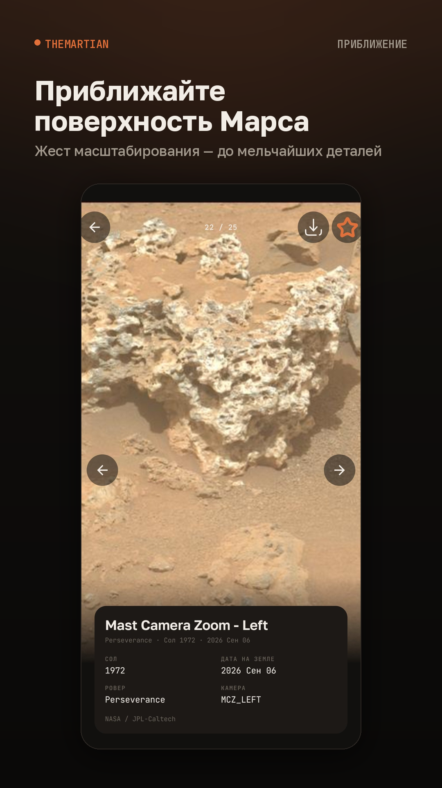

# TheMartian

TheMartian — это реальные фото Марса, снятые марсоходами NASA. В приложении собраны снимки четырёх роверов, два из которых до сих пор работают на Красной планете, поэтому новые фото с Марса появляются практически ежедневно.

**МАРСОХОДЫ**
- Perseverance (Персеверанс) — действующий, исследует кратер Езеро
- Curiosity (Кьюриосити) — действующий, поднимается на гору Шарп
- Opportunity (Оппортьюнити) — миссия завершена
- Spirit (Спирит) — миссия завершена

**УДОБНЫЙ ПОИСК СНИМКОВ**
- Фильтр по марсоходу, дате и камере
- Свежий кадр каждого ровера на главном экране
- Карточка ровера: дата запуска, дата посадки, последние фото, всего фото

**РАССМАТРИВАЙТЕ ДЕТАЛИ**
- Приближайте фото поверхности Марса жестом: камни, дюны, кратеры, следы колёс
- Информация о снимке: сол (марсианские сутки), дата на Земле, камера, освещение
- Отметки «часть панорамы» и «стереопара»

**СОХРАНЯЙТЕ ЛУЧШЕЕ**
- Добавляйте снимки Марса в избранное
- Скачивайте фото на телефон
- Кэш ускоряет загрузку; размер кэша можно настроить или очистить в настройках

Изображения: NASA/JPL-Caltech. TheMartian — независимое приложение, не является официальным приложением NASA.

Окунитесь в неповторимую атмосферу Красной планеты. Приятного полёта!

  

# Screenshots
   

# Technology
- Kotlin
- Kotlin Coroutines/Flow
- MVI
- Jetpack Compose
- Jetpack Navigation Component
- Koin
- Retrofit
- Room
- WorkManager
